<b>Build in public。致力于把 AI 前沿技术落地成真正用得上的应用，下面每个项目都在公开中一点点长大。</b> 
<b>Building in public, bringing frontier AI down to earth as apps people actually use. Every project below is growing up in the open.</b>

    

## 🎬 video-shotcraft

<b>让每个产品，都有一次电影般的登场。</b>agent 走进你的页面，在 124 张镜头配方里为它挑好机位，再让光影、运镜和鼓点替它开口。不借助视频模型，每一帧都由代码写成。 
<b>Every product deserves its opening shot.</b> Your agent walks through your pages, picks the angles from 124 shot recipes, then lets light, camera and beat speak for it. No video model: every frame is written in code.

## 🔭 anything2explainer

<b>问出一个问题，点亮一片星空。</b>agent 替你翻遍资料，写下讲稿，配上声音，再一镜一镜点亮黑色的画布，直到复杂的事变得清澈。中文英文都可以。 
<b>Ask a question. Watch the sky light up.</b> It reads widely, writes the narration, gives it a voice, then lights the black canvas one shot at a time until the complicated turns clear. In Chinese or English.

## 🎙️ video-talkcraft

<b>每个字落下，画面就跟着呼吸。</b>在本地对齐每一个字的时间，让镜头追着声音的起伏走，口播从此不像一页页翻过的幻灯片。 
<b>Every word lands, and the picture breathes with it.</b> Word-level timing aligned on your own machine, a camera that follows the rise and fall of the voice: talking videos that never feel like slides.

## 🎨 mg-styles-15

<b>十五句话，长成十五种律动。</b>每一种动效风格，都由 Claude Opus 5.5 从一句提示词写成代码。成片、提示词和完整源码都摊在这里，随你拆开来看。 
<b>Fifteen sentences, fifteen ways to move.</b> Each style was coded by Claude Opus 5.5 from a single prompt. The films, the prompts and every line of source are laid out here to take apart.

